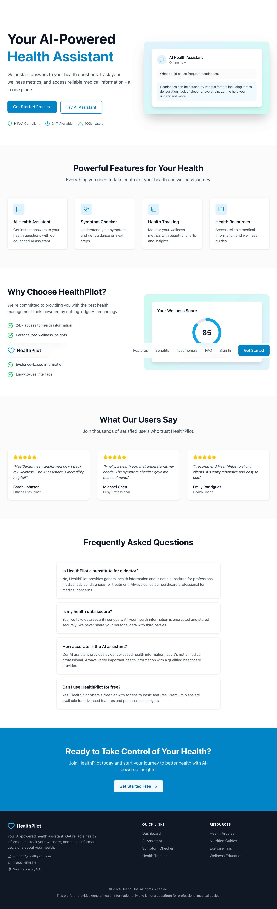

# 🩺 HealthPilot

> **Your intelligent health companion.**

HealthPilot is a modern AI-powered healthcare web application designed to help users explore health-related questions, better understand symptoms, track wellness, and access reliable health education through a simple and intuitive digital experience.



---

## ✨ Features

### 🤖 AI Health Assistant

Interact with an AI-powered assistant to ask general health and wellness questions and receive easy-to-understand educational information.

- Conversational AI interface
- Suggested questions
- Conversation history
- Typing indicators
- Responsive chat experience
- Clear AI safety and medical disclaimers

### 🩺 Symptom Checker

Users can describe symptoms and receive educational information about possible causes and recommended next steps.

> **Disclaimer:** HealthPilot is an educational tool and does not provide medical diagnoses or replace professional medical advice.

### 📊 Wellness Dashboard

A centralized dashboard for monitoring important wellness information.

- Health metrics
- Activity overview
- Wellness progress
- Recent AI conversations
- Health reminders
- Visual data representation

### 📈 Health Tracking

Track and visualize wellness metrics such as:

- Heart rate
- Blood pressure
- Blood sugar
- Sleep
- Water intake
- Exercise
- Weight

### 📚 Health Resources

Browse educational content covering:

- General health
- Nutrition
- Fitness
- Sleep
- Mental wellness
- Preventive care

### 📱 Responsive Design

Designed to provide a consistent experience across:

- Desktop
- Tablet
- Mobile

---

| Technology    | Purpose                     |
| ------------- | --------------------------- |
| React         | UI development              |
| TypeScript    | Type safety                 |
| Tailwind CSS  | Styling & responsive design |
| Vite          | Development & build tooling |
| React Router  | Application routing         |
| Framer Motion | Animations & interactions   |
| Zustand       | State management            |
| Axios         | API communication           |
| Recharts      | Data visualization          |
| Lucide React  | UI icons                    |

---

## 🏗️ Project Structure

```text
src/
├── assets/
├── components/
├── features/
│   ├── ai-assistant/
│   ├── dashboard/
│   ├── symptom-checker/
│   ├── tracker/
│   └── resources/
├── hooks/
├── layouts/
├── pages/
├── routes/
├── services/
├── store/
├── types/
├── utils/
├── App.tsx
└── main.tsx
```

---

## 🚀 Getting Started

### Prerequisites

Make sure you have the following installed:

- Node.js
- npm

### Installation

Clone the repository:

```bash
git clone YOUR_REPOSITORY_URL
```

Navigate into the project:

```bash
cd HealthPilot
```

Install dependencies:

```bash
npm install
```

Start the development server:

```bash
npm run dev
```

The application will be available at:

```text
http://localhost:5173
```

---

## 🔐 Environment Variables

If the project uses external APIs, create a `.env` file in the root directory:

```env
VITE_API_URL=your_api_url
VITE_AI_API_KEY=your_api_key
```

> Never commit API keys or other sensitive credentials to GitHub.

---

## 🎯 Project Goals

HealthPilot was created to explore how AI can be integrated into a modern healthcare interface while maintaining a strong focus on:

- User experience
- Accessibility
- Responsive design
- Clear communication
- Responsible AI usage
- Scalable frontend architecture

The project also demonstrates how complex health-related information can be presented through a clean and approachable interface.

---

## 🧠 AI Safety

HealthPilot is designed as an **educational health assistant**, not a replacement for qualified healthcare professionals.

The AI assistant should:

- Provide general educational information
- Explain health concepts in simple language
- Clearly communicate its limitations
- Encourage professional medical advice when appropriate
- Direct users toward emergency services for potentially urgent situations

HealthPilot does **not** diagnose medical conditions, prescribe medication, or replace professional medical care.

---

## 🔮 Future Improvements

- Real AI API integration
- Secure user authentication
- Personalized health insights
- Wearable device integration
- Appointment management
- Medication reminders
- Health report generation
- Secure backend and database
- Advanced health analytics

---

## 👨‍💻 Developer

**Opeoluwa Bello**

Frontend Developer focused on building modern, responsive, and user-friendly digital experiences with React, TypeScript, Next.js, and modern frontend technologies.

---

## ⭐ Support

If you find HealthPilot interesting, consider giving the repository a ⭐ on GitHub.
